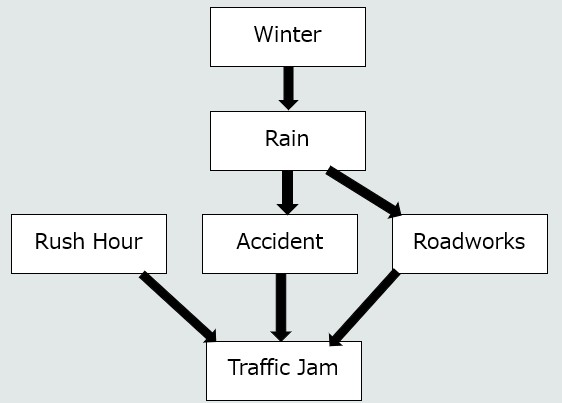

# Week 5 Task

Today we are simply going to extend a Bayesian Network based off what you observed in the lecture

You can find the lecture example [here](https://github.com/darrened/526/tree/main/Week5/example.py)

First, in order to run this program, we are going to need a couple of libraries:

```bash
pip install pgmpy
```
Just to note, the above install will take a little longer than you are used to.

In addition, I also used the library 'daft' to output the model graphically:

```bash
pip install daft
```
Ok! Now we should be ready to go. 

## Tasks

1. Simply run the provided example. Provide see what outcomes you get when you provide it different values 
(or do not provide certain values). Don't forget, you can also go backwards.


2. See the diagram below, update the provided example so that it now accomodates the new nodes - you will need to make 
up the CPDs for now.
The order of difficulty (from easiest to hardest) is:
   1. Create 'Winter' node
   2. Create 'Rush Hour' node
   3. Update CPDs for 'Rain'
   4. Update CPDs for Roadworks
   5. Update CPDs for Traffic Jam

